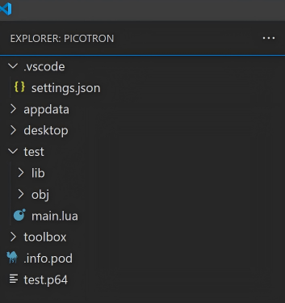
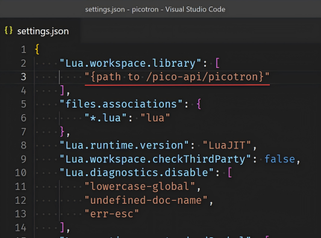
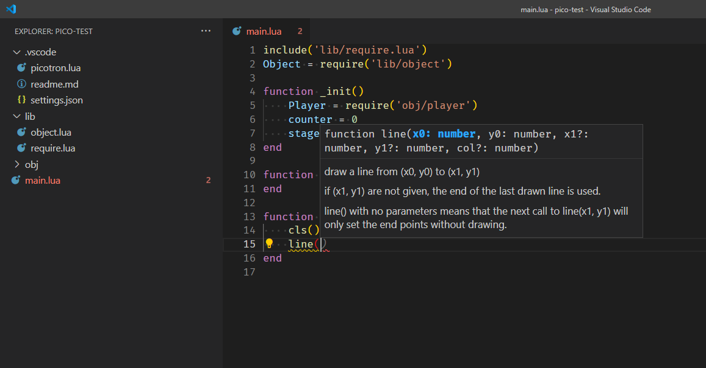

# pico-api

pico-api is a project consisting of definition files for the sumneko/lua extension for VSCode, allowing you to write PICO-8 or Picotron programs with the support of modern editor features.

## Setup

1. Install and enable [sumneko/Lua](https://marketplace.visualstudio.com/items?itemName=sumneko.lua) extension in VSCode Marketplace

    

2. Download [pico-api](https://github.com/ahai64/pico-api)

3. New a folder *.vscode* in your workspace, and put the file *setting.json* into it

    

4. Change the field *Lua.workspace.library* in *.vscode/settings.json* to the path to the folder *picotron*(or folder *pico8*, depending on the type of your project)

    

5. New a cartridge and use this snippet at the top of its code:

    ```lua
    -- picotron
    cd("/myproj")
    include("main.lua")
    ```
    ```lua
    -- pico8
    #include main.lua
    ```

Then you can write code in the workspace of VSCode and enjoy code prompts, formatting, AI copilot, etc.



## Issues

[Picotron Shorthand](https://www.lexaloffle.com/dl/docs/picotron_manual.html#Picotron_Shorthand) is not completely supported.

> `!=` operator and shorthand assignment operators (like `+=`, `-=`, etc) can be used now. Thanks to @arnaught.

This is a very rough version. Welcome to submit issues and PRs.

## Reference

https://marketplace.visualstudio.com/items?itemName=sumneko.lua

https://github.com/ahai64/pico-api

https://www.lexaloffle.com/bbs/?tid=53227